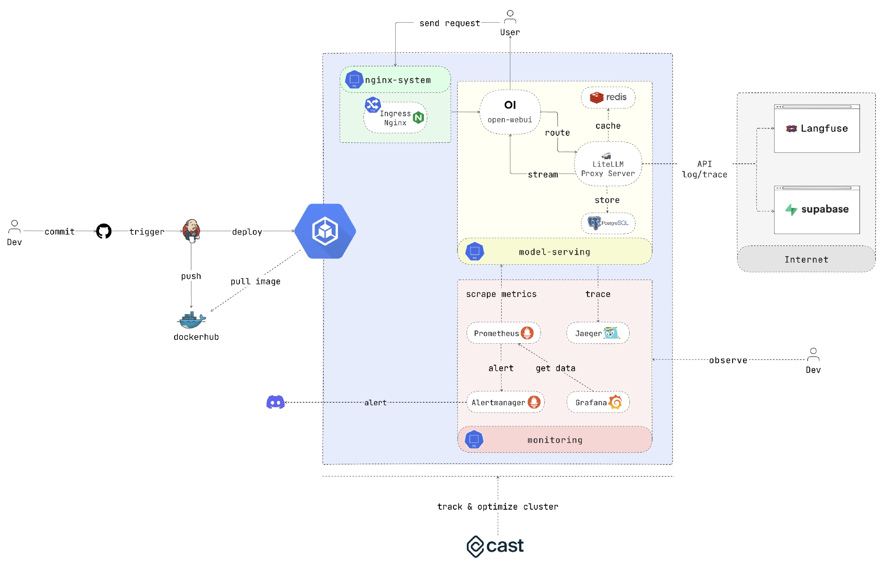

# PromptAlchemy (WIP)
[](https://api.github.com/repos/bmd1905/PromptAlchemy)

MLOps for LLMs, Simplified: PromptAlchemy Takes the Complexity Out.

 [](#features)

## Introduction

PromptAlchemy is a project built with Open WebUI that can be deployed on Google Kubernetes Engine (GKE) for managing and scaling language models. It offers both Terraform and manual deployment methods, and incorporates robust MLOps practices. This includes CI/CD pipelines with Jenkins and Ansible for automation, monitoring with Prometheus and Grafana for performance insights, and centralized logging with the ELK stack for troubleshooting and analysis. Developers can find detailed documentation and instructions on the project's website.

## Features

- **Ease of Use**: EasyLLMOps provides an intuitive interface and streamlined workflows that make managing LLMs simple and efficient, regardless of your experience level.
- **Scalability & Flexibility**: Scale your LLM deployments effortlessly, adapt to evolving needs, and integrate seamlessly with your existing infrastructure.
- **Reduced Complexity**: Eliminate the hassle of complex configurations and infrastructure management, allowing you to focus on building and deploying powerful LLM applications.
- **Enhanced Productivity**: Accelerate your LLM development lifecycle, optimize performance, and maximize the impact of your language models.

## Target Audience

Developers building and deploying LLM-powered applications.
Data scientists and machine learning engineers working with LLMs.
DevOps teams responsible for managing LLM infrastructure.
Organizations looking to integrate LLMs into their operations.

## Getting Started

In case you don't want to spend much time, please run this script and enjoy your coffee:
```bash
chmod +x ./cluster.sh
./cluster.sh
```

### Using Terraform for Google Kubernetes Engine (GKE)

**1. Set up the Cluster:**

If you're deploying the application to GKE, you can use Terraform to automate the setup of your Kubernetes cluster. Navigate to the `iac/terraform` directory and initialize Terraform:

```bash
cd iac/terraform
terraform init
```


**Plan and Apply Configuration:**

  Generate an execution plan to verify the resources that Terraform will create or modify, and then apply the configuration to set up the cluster:

  ```bash
  terraform plan
  terraform apply
  ```

**2. Retrieve Cluster Information:**

To interact with your GKE cluster, you'll need to retrieve its configuration. You can view the current cluster configuration with the following command:

```bash
cat ~/.kube/config
```


Ensure your `kubectl` context is set correctly to manage the cluster.

### Manual Deployment to GKE

For a more hands-on deployment process, follow these steps:

**1. Deploy Nginx Ingress Controller:**

The Nginx Ingress Controller manages external access to services in your Kubernetes cluster. Create a namespace and install the Ingress Controller using Helm:

```bash
kubectl create ns nginx-system
kubens nginx-system
helm upgrade --install nginx-ingress ./deployments/nginx-ingress
```

Please story the Nginx Ingress Controller's IP address, as you'll need it later.


**2. Configure API Key Secret:**

Store your environment variables, such as API keys, securely in Kubernetes secrets. Create a namespace for model serving and create a secret from your `.env` file:

```bash
kubectl create ns model-serving
kubens model-serving
kubectl delete secret promptalchemy-env 
kubectl create secret generic promptalchemy-env --from-env-file=.env -n model-serving
kubectl describe secret promptalchemy-env -n model-serving
```


**3. Grant Permissions:**

Kubernetes resources often require specific permissions. Apply the necessary roles and bindings:

```bash
cd deployments/infrastructure
kubectl apply -f role.yaml
kubectl apply -f rolebinding.yaml
```


**4. Deploy caching service using Redis:**

Now, deploy the semantic caching service using Redis:
```bash
cd ./deployments/redis
helm dependency build
helm upgrade --install redis .
```


**5. Deploy LiteLLM:**

Deploy the [LiteLLM](https://github.com/BerriAI/litellm) service:

```bash
kubens model-serving
helm upgrade --install litellm ./deployments/litellm
```


**6. Deploy the Open WebUI:**

Next, Deploy the web UI to your GKE cluster:

```bash
cd open-webui
kubectl apply -f ./kubernetes/manifest/base -n model-serving
```


**7. Play around with the Application:**

Open browser and navigate to the URL of your GKE cluster (e.g. `http://172.0.0.0` in step 1) and add `.nip.io` to the end of the URL (e.g. `http://172.0.0.0.nip.io`). You should see the Open WebUI:


### Continuous Integration/Continuous Deployment (CI/CD) with Jenkins and Ansible

For automated CI/CD pipelines, use Jenkins and Ansible as follows:

**1. Set up Jenkins Server:**

First, create a Service Account and assign it the `Compute Admin` role. Then create a Json key file for the Service Account and store it in the `iac/ansible/secrets` directory.

Next create a Google Compute Engine instance named "jenkins-server" running Ubuntu 22.04 with a firewall rule allowing traffic on ports 8081 and 50000.

```bash
ansible-playbook iac/ansible/deploy_jenkins/create_compute_instance.yaml
```

Deploy Jenkins on a server by installing prerequisites, pulling a Docker image, and creating a privileged container with access to the Docker socket and exposed ports 8081 and 50000.

```bash
ansible-playbook -i iac/ansible/inventory iac/ansible/deploy_jenkins/deploy_jenkins.yaml
```


**2. Access Jenkins:**

To access the Jenkins server through SSH, we need to create a public/private key pair. Run the following command to create a key pair:

```bash
ssh-keygen
```

Open `Metadata` and copy the `ssh-keys` value.


We need to find the Jenkins server password to be able to access the server. First, access the Jenkins server:

```bash
ssh <USERNAME>:<EXTERNAL_IP>
```

Then run the following command to get the password:

```bash
sudo docker exec -it jenkins-server bash
cat /var/jenkins_home/secrets/initialAdminPassword
```


Once Jenkins is deployed, access it via your browser:
 
```plaintext
http://<EXTERNAL_IP>:8081
```


**3. Install Jenkins Plugins:**

Install the following plugins to integrate Jenkins with Docker, Kubernetes, and GKE:

- Docker
- Docker Pipeline
- Kubernetes
- Google Kubernetes Engine

After installing the plugins, restart Jenkins.

```bash
sudo docker restart jenkins-server
```


**4. Configure Jenkins:**

4.1. Add webhooks to your GitHub repository to trigger Jenkins builds.

Go to the GitHub repository and click on `Settings`. Click on `Webhooks` and then click on `Add Webhook`. Enter the URL of your Jenkins server (e.g. `http://<EXTERNAL_IP>:8081/github-webhook/`). Then click on `Let me select individual events` and select `Let me select individual events`. Select `Push` and `Pull Request` and click on `Add Webhook`.


4.2. Add Github repository as a Jenkins source code repository.

Go to Jenkins dashboard and click on `New Item`. Enter a name for your project (e.g. `prompt-alchemy`) and select `Multibranch Pipeline`. Click on `OK`. Click on `Configure` and then click on `Add Source`. Select `GitHub` and click on `Add`. Enter the URL of your GitHub repository (e.g. `https://github.com/bmd1905/PromptAlchemy`). In the `Credentials` field, select `Add` and select `Username with password`. Enter your GitHub username and password (or use a personal access token). Click on `Test Connection` and then click on `Save`.


4.3. Setup docker hub credentials.

First, create a Docker Hub account. Go to the Docker Hub website and click on `Sign Up`. Enter your username and password. Click on `Sign Up`. Click on `Create Repository`. Enter a name for your repository (e.g. `prompt-alchemy`) and click on `Create`.

From Jenkins dashboard, go to `Manage Jenkins` > `Credentials`. Click on `Add Credentials`. Select `Username with password` and click on `Add`. Enter your Docker Hub username, access token, and set `ID` to `dockerhub`.


4.4. Setup Kubernetes credentials.

First, create a Service Account for the Jenkins server to access the GKE cluster. Go to the GCP console and navigate to IAM & Admin > Service Accounts. Create a new service account with the `Kubernetes Engine Admin` role. Give the service account a name and description. Click on the service account and then click on the `Keys` tab. Click on `Add Key` and select `JSON` as the key type. Click on `Create` and download the JSON file.


Then, from Jenkins dashboard, go to `Manage Jenkins` > `Cloud`. Click on `New cloud`. Select `Kubernetes`. Enter the name of your cluster (e.g. `gke-prompt-alchemy-cluster-1), enter the URL and Certificate from your GKE cluster. In the `Kubernetes Namespace`, enter the namespace of your cluster (e.g. `model-serving`). In the `Credentials` field, select `Add` and select `Google Service Account from private`. Enter your project-id and the path to the JSON file.


**5. Test the setup:**

Push a new commit to your GitHub repository. You should see a new build in Jenkins.


### Monitoring with Prometheus and Grafana

**1. Create Discord webhook:**

First, create a Discord webhook. Go to the Discord website and click on `Server Settings`. Click on `Integrations`. Click on `Create Webhook`. Enter a name for your webhook (e.g. `prompt-alchemy-discord-webhook`) and click on `Create`. Copy the webhook URL.


**2. Configure Helm Repositories**

First, we need to add the necessary Helm repositories for Prometheus and Grafana:

```bash
helm repo add prometheus-community https://prometheus-community.github.io/helm-charts
helm repo add grafana https://grafana.github.io/helm-charts
helm repo update
```

These commands add the official Prometheus and Grafana Helm repositories and update your local Helm chart information.

**3. Install Dependencies**

Prometheus requires certain dependencies that can be managed with Helm. Navigate to the monitoring directory and build these dependencies:

```bash
helm dependency build ./deployments/monitoring/kube-prometheus-stack
```

**4. Deploy Prometheus**

Now, we'll deploy Prometheus and its associated services using Helm:

```bash
kubectl create namespace monitoring
helm upgrade --install -f deployments/monitoring/kube-prometheus-stack.expanded.yaml kube-prometheus-stack deployments/monitoring/kube-prometheus-stack -n monitoring
```

This command does the following:
- `helm upgrade --install`: This will install Prometheus if it doesn't exist, or upgrade it if it does.
- `-f deployments/monitoring/kube-prometheus-stack.expanded.yaml`: This specifies a custom values file for configuration.
- `kube-prometheus-stack`: This is the release name for the Helm installation.
- `deployments/monitoring/kube-prometheus-stack`: This is the chart to use for installation.
- `-n monitoring`: This specifies the namespace to install into.


By default, the services are not exposed externally. To access them, you can use port-forwarding:

For Prometheus:
```bash
kubectl port-forward -n monitoring svc/kube-prometheus-stack-prometheus 9090:9090
```
Then access Prometheus at `http://localhost:9090`

For Grafana:
```bash
kubectl port-forward -n monitoring svc/kube-prometheus-stack-grafana 3000:80
```
Then access Grafana at `http://localhost:3000`

The default credentials for Grafana are usually:
- Username: admin
- Password: prom-operator (you should change this immediately)


**5. Test Alerting**

First we need to create a sample alert. Navigate to the `monitoring` directory and run the following command:

```bash
kubectl port-forward -n monitoring svc/alertmanager-operated 9093:9093
```

Then, in a new terminal, run the following command:

```bash
curl -XPOST -H "Content-Type: application/json" -d '[
  {
    "labels": {
      "alertname": "DiskSpaceLow",
      "severity": "critical",
      "instance": "server02",
      "job": "node_exporter",
      "mountpoint": "/data"
    },
    "annotations": {
      "summary": "Disk space critically low",
      "description": "Server02 has only 5% free disk space on /data volume"
    },
    "startsAt": "2023-09-01T12:00:00Z",
    "generatorURL": "http://prometheus.example.com/graph?g0.expr=node_filesystem_free_bytes+%2F+node_filesystem_size_bytes+%2A+100+%3C+5"
  },
  {
    "labels": {
      "alertname": "HighMemoryUsage",
      "severity": "warning",
      "instance": "server03",
      "job": "node_exporter"
    },
    "annotations": {
      "summary": "High memory usage detected",
      "description": "Server03 is using over 90% of its available memory"
    },
    "startsAt": "2023-09-01T12:05:00Z",
    "generatorURL": "http://prometheus.example.com/graph?g0.expr=node_memory_MemAvailable_bytes+%2F+node_memory_MemTotal_bytes+%2A+100+%3C+10"
  }
]' http://localhost:9093/api/v2/alerts
```

This command creates a sample alert. You can verify that the alert was created by running the following command:

```bash
curl http://localhost:9093/api/v2/status
```

Or, you can manually check the Discord channel.


---

This setup provides comprehensive monitoring capabilities for your Kubernetes cluster. With Prometheus collecting metrics and Grafana visualizing them, you can effectively track performance, set up alerts for potential issues, and gain valuable insights into your infrastructure and applications.

### Logging with Filebeat + Logstash + Elasticsearch + Kibana

Centralized logging is essential for monitoring and troubleshooting applications deployed on Kubernetes. This section guides you through setting up an ELK stack (Elasticsearch, Logstash, Kibana) with Filebeat for logging your GKE cluster.

**0. Quick run**

You can use this single bash script to kick off the ELK stack:

```bash
cd ELK
chmod +x ./run.sh
./run.sh
```

**1. Install ELK Stack with Helm**

We will use Helm to deploy the ELK stack components:

- **Elasticsearch:** Stores the logs.
- **Logstash:** Processes and filters the logs.
- **Kibana:** Provides a web UI for visualizing and searching logs.
- **Filebeat:** Collects logs from your pods and forwards them to Logstash.

First, create a namespace for the logging components:

```bash
kubectl create ns logging
kubens logging
```

Next, install Elasticsearch:

```bash
helm install elk-elasticsearch elastic/elasticsearch -f deployments/ELK/elastic.expanded.yaml --namespace logging --create-namespace
```

Wait for Elasticsearch to be ready:

```bash
echo "Waiting for Elasticsearch to be ready..."
kubectl wait --for=condition=ready pod -l app=elasticsearch-master --timeout=300s
```

Create a secret for Logstash to access Elasticsearch:

```bash
kubectl create secret generic logstash-elasticsearch-credentials \
  --from-literal=username=elastic \
  --from-literal=password=$(kubectl get secrets --namespace=logging elasticsearch-master-credentials -ojsonpath='{.data.password}' | base64 -d)
```

Install Kibana:

```bash
helm install elk-kibana elastic/kibana -f deployments/ELK/kibana.expanded.yaml
```

Install Logstash:

```bash
helm install elk-logstash elastic/logstash -f deployments/ELK/logstash.expanded.yaml
```

Install Filebeat:

```bash
helm install elk-filebeat elastic/filebeat -f deployments/ELK/filebeat.expanded.yaml
```


**2. Access Kibana:**

Expose Kibana using a service and access it through your browser:

```bash
kubectl port-forward -n logging svc/elk-kibana-kibana 5601:5601
```

Please use this script to get the Kibana password:
```bash
kubectl get secrets --namespace=logging elasticsearch-master-credentials -ojsonpath='{.data.password}' | base64 -d
```

Open your browser and navigate to `http://localhost:5601`.

**3. Verify Log Collection**

You should now be able to see logs from your Kubernetes pods in Kibana. You can create dashboards and visualizations to analyze your logs and gain insights into your application's behavior.


## Contributing
We welcome contributions to PromptAlchemy! Please see our CONTRIBUTING.md for more information on how to get started.

## License
PromptAlchemy is released under the MIT License. See the LICENSE file for more details.

## Citation
If you use PromptAlchemy in your research, please cite it as follows:
```
@software{PromptAlchemy2024,
  author = {Minh-Duc Bui},
  title = {PromptAlchemy: Transform basic queries into sophisticated prompts},
  year = {2024},
  url = {https://github.com/bmd1905/PromptAlchemy}
}
```

## Contact
For questions, issues, or collaborations, please open an issue on our GitHub repository or contact the maintainers directly.